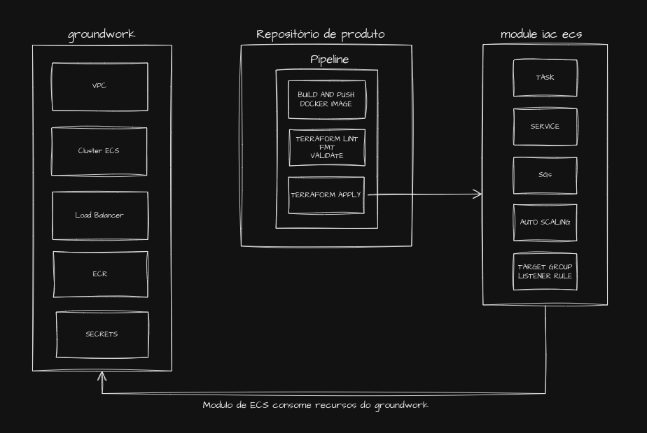

# Projeto Final Terraform intensivo repo de produto

Repositório que simula uma aplicação web.

### Módulo de ECS

Criado um [Módulo ECS](https://github.com/jhtoigo/terraform-aws-service.git) responsavel por criar:

* Task
* Service
* Security groups
* IAM
* Auto Scaling
* Target Group
* Listener Rule

### Pipeline:

* Cria imagem docker da aplicação e fazer o push para o repositório ECR.
* Efetuar testes do Terraform: 
    * Lint
    * fmt
    + validate
* Efetuar deploy do service em cluster ECS criado no repo de groundwork.




### Build da aplicação utilizando docker

Build do node.js

```sh
# Faz o build da imagem
$ docker build -t pgtest .
# Executa o container
$ docker run --env-file=.env -p 3001:3001 --network pgadmin_default pgtest
```

Ao acessar: http://localhost:3001

Se obtem o retorno abaixo em caso de sucesso:

#### Connected to database: postgres on server: 10.0.0.2 at Tue Aug 13 2024 19:52:42 GMT+0000 (Coordinated Universal Time)
